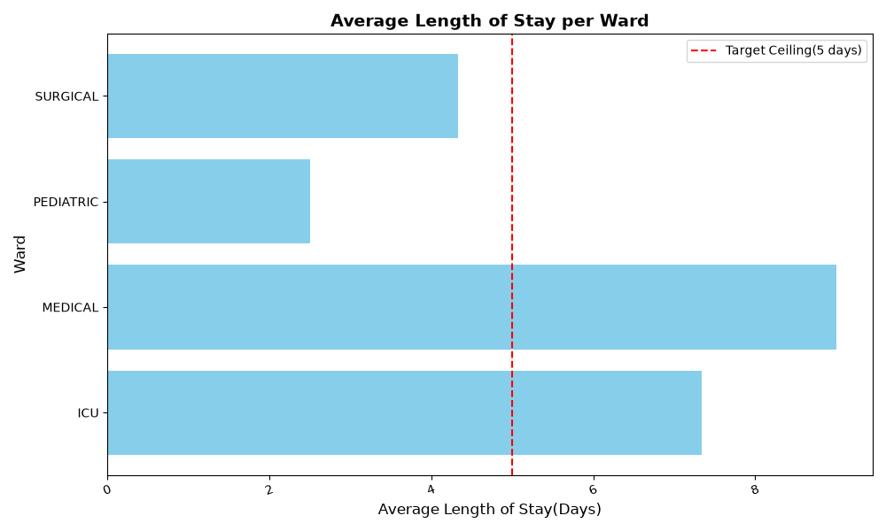
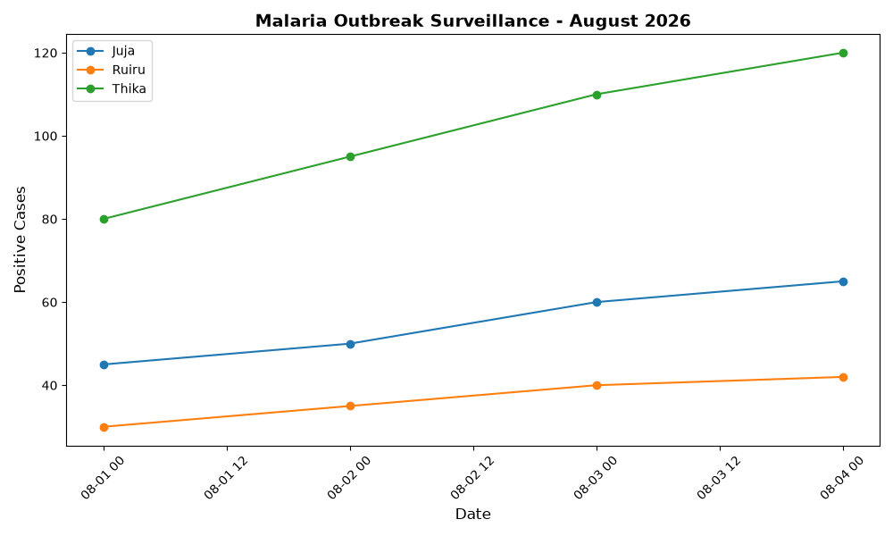
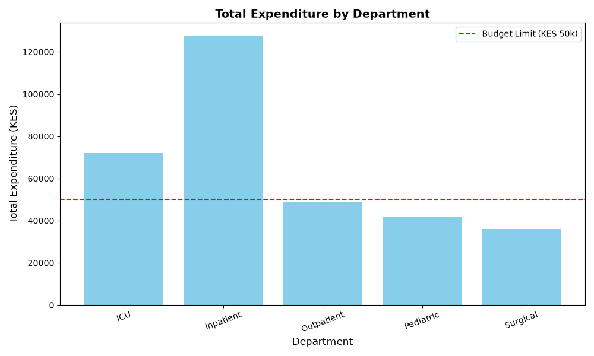

# Healthcare Data Analytics & Operations Portfolio

A collection of end-to-end Python data pipelines and visualizations built to analyze clinical operations, track epidemiological outbreaks, and audit pharmacy expenditures.

---

##  Projects Overview

### 1. Hospital Readmissions & Length of Stay Analyzer
* **Script:** `readmissions_analyzer.py`
* **Summary:** Standardized hospital ward nomenclature, handled missing readmission records, calculated exact patient Length of Stay (LOS) using date arithmetic, and highlighted wards exceeding the 5-day ceiling target.
* **Output:**
  

---

### 2. Regional Disease Outbreak Surveillance Tracker
* **Script:** `outbreak_tracker.py`
* **Summary:** Normalized regional sub-county names, calculated Malaria positivity rates (%), and plotted multi-series time-series line charts tracking epidemic trajectories across sub-counties.
* **Output:**
  

---

### 3. Pharmacy Drug Expenditure Audit
* **Script:** `pharmacy_expenditure_audit.py`
* **Summary:** Cleaned unformatted currency strings, computed department-level drug consumption costs, and visualised budget utilization against a KES 50,000 ceiling limit.
* **Output:**
  

---

##  Tech Stack
* **Language:** Python 3.14
* **Libraries:** Pandas (Data Transformation & Aggregation), Matplotlib (Data Visualization)
* **Version Control:** Git & GitHub